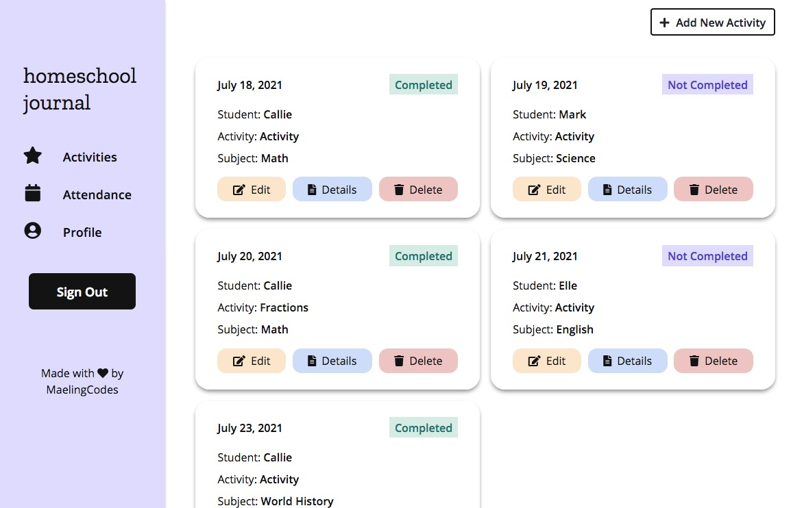

# homeschool-journal

homeschool journal is a web application that enables homeschooling facilitators to schedule and record activities for their students, as well as log attendance records. 

~~**LIVE SITE**~~:  https://homeschool-journal.herokuapp.com/ 
**Update (12/14/22):** This app was previously hosted on Heroku when they still had their free development tier. Will host this app on a different platform soon!

## VIDEO WALKTHROUGH

## TECH STACK
- HTML
- CSS
- vanilla JavaScript
- Flask (Python web micro framework) and related packages:
    - Flask-Login (user session management for Flask)
    - Flask-WTForms (form handling)
    - Flask-SQLAlchemy (SQL Python database toolkit)
    - Flask-Migrate (SQLAlchemy database migration handling)
- Jinja2 (templating engine) 
- PostgreSQL (relational database management system)

## MOTIVATION
I started designing and building this site to give homeschool facilitators a simple way to log the activities and attendance of their students in one place. The goal was to create a solution that would also simplify the record-keeping process required of homeschoolers based on the homeschooling regulations of some states in the United States.

As a student in Harvard's CS50x Introduction to Computer Science course, this project also fulfilled final project requirements for the course. 

## FEATURES
homeschool journal users can:
- Register for an account
- Sign In/Sign Out (guest login functionality also provided for demo purposes)
- Manage students & subjects on their account profile
- Add/View/Update/Delete activities on a student’s record
- Add/Delete attendance records for a student
- Log attendance for the current day on the homepage
- Filter the display of scheduled activities by student and different time frames on the homepage

